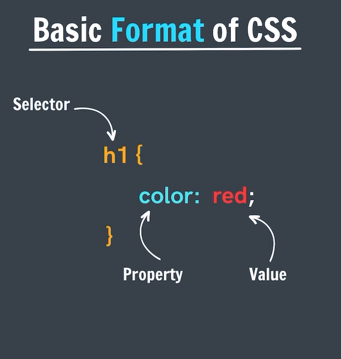
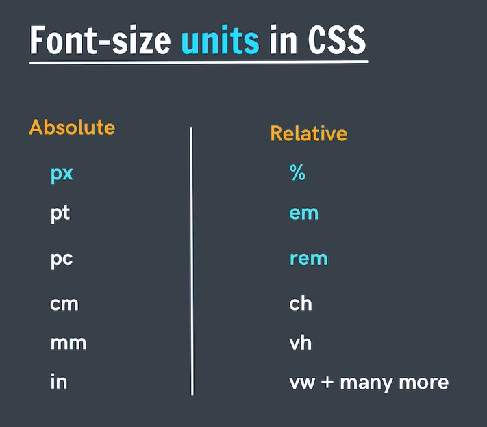

# __apnaCollege-CSS

## <mark>CSS</mark> (Cascading Style Sheet)

### What is <mark>CSS</mark>?

It is a language that is used to describe the <mark>style</mark> of a document.

## Basic <mark>Format</mark> of CSS : 



always use semicolon (;) after value.   

## How to <mark>Include</mark> Style :

## 1. Inline Styles
Writing style directly inline on each element.   
`<h1 style="color:red"> Apna College </h1>`

## 2. Using `<style>` tag :
Style is added using the `<style>` element in the same document  
It is feasible for only one page.   
```
<style>
    h1{
        color: red;
    }
</style>
```
 

 ## 3. External Stylesheet :
 Writing CSS in a separate document (css file) & linking it with HTML file.   
 extension of this css file is `.css`

 ### <mark>Linking</mark> HTML with CSS File :

 ```
 <head>
    // write always this line after `<title>` tag 
    <link rel="stylesheet" href="style.css">
 </head>
 ``` 
## <mark>Color</mark> Property :

Used to set the color of forground   
`color: purple;`   
`color: #ffffff;`    


## <mark>Background Color</mark> Property :

Used to set the color of background   
`background-color: purple;`   
`background-color: #ffffff;`    
we can also use `background : #000` but not recommended for to set background color


## Color Systems :

#### Named Color
 color = black;   
Each browser recognizes around 140-150 named colors.    
Eg- red, blue, pink, purple, magenta, teal etc.

#### RGB 

`color = rgb(0,0,0);`   
Red Green Blue (0-255)   
black is rgb(255, 0, 0)    
red is rgb(0, 0, 0)    
blue is rgb(0, 0, 255)    
yellow is rgb(255, 255, 0)    


#### Hexadecimal or Hex

`color = #ffffff`   
`color = #fff`   we can also write like this       
`color = #ffa511`

Letters: 0, 1, 2, 3, 4, 5, 6, 7, 8, 9, A, B, C, D, E, F (Number System) => base 16

## Text Properties :

- text-align
- font-weight  
- text-decoration  
- line-height  
- letter-spacing  
- font-size  

#### text-align : 
this property does not work according to body/screen, it always works according to its parent. It is relative to its parent.

start and end property came in CSS3. 

- text-align : left/start
- text-align : right/end
- text-align : center
- text-align : justify -- for horizontal alignment.


#### font-weight :
light and bold  
100-900  

- font-weight: normal   //400
- font-weight: bold   //700
- font-weight: 100
- font-weight: bolder
- font-weight: lighter

## text-decoration :
sets the <mark>appearance of decorative lines</mark> on text like underline   

- text-decoration: underline
- text-decoration: overline
- text-decoration: line-throungh
- text-decoration: none
- text-decoration: red underline (imp..)
- text-decoration: wavy line-throungh (imp..)
- text-decoration: dotted red line-throungh (imp..)
- text-decoration-color: red
- text-decoration-style: red

## line-height :
controls the <mark>height</mark> of the line text

- line-height: normal
- line-height: 2.5 (times) we can also give in px, em, % etc.

## letter-spacing :
controls the <mark>horizontal spacing</mark> behavior between text characters  

- letter-spacing: normal
- letter-spacing: 10px

## Font-size units in CSS :


- 1 inch - 96px

### Pixels (px) :
most commonly used absolute unit    
96px = 1 inch   
not suitable for responsive websites, here we use relative units.   
`font-size: 50px;`


## font-family :
specifies a prioritized list of one or more font family names   
`font-family: arial;`
`font-family: avant grade, didot, sans-serif;` here sans-serif as a backup family of fonts   
`cssfontstack.com` visit for font-family   

## text-transform :